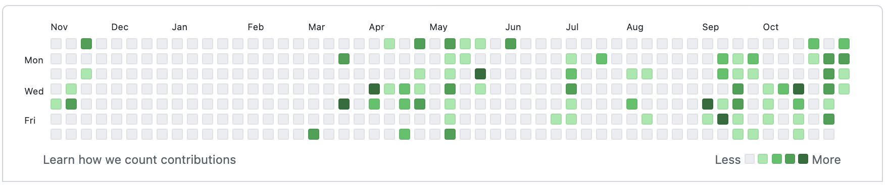

# 잔디 잃고 git 사용법 익힌다.


WTF...

## 잔디가 전부 뽑혀 날아가버렸다.

최근 pull을 하지 않고 작업물을 변경하면서 conflict로 인해서 스트레스를 엄청나게 받고 있었다. 그래서 나는 pull을 강제로 해서 문제들을 해결해왔다.

하지만 알수 없는 이유로 pull을 강제로 해도 되지 않았고, 양쪽 작업물 사이에서 왔다 갔다 하는 와중에 결국 나는 clone을 해서 작업물 기록을 새로 업데이트 하지 않고 어떻게 한건지 모르겠는 신박한 방법으로 push를 했다.(아마도 --force를 한듯하다.) 정말 어떻게 했는지 기억이 나지 않는다. .git 파일을 삭제하고 초기화한건지 뭔지는 모르겠지만... 잔디가 갑자기 전부 뽑힌것을 보고 당황했다. 이전에 저장해놨던 작업물이라도 있지 않을까 해서 노트북과 데스크탑을 모두 뒤졌지만 찾을 수 없었고, 결국 log를 복구할수조차 없는 상황이 되었다.

> 만약에 지금 상황이 회사였다면 나는 어떻게 됐을까?

생각만해도 끔찍하다. 시말서 감일까? 아니면 잘리게될까? 휴... 정말 그 자리에 있는 것을 상상만해도 지옥같다. 어쨌든 내가 지금까지 열심히 심었던 잔디가 한순간에 뽑혀 없어진 것을 보니 정말 화가나고 이전 기록으로 롤백할수도 없으니 (그럴일은 없겠지만) 만약 작업에서 치명적인 무언가가 발견되었을 때 되돌아갈 수도 없으니까 문제가 생기면 일일히 수작업으로 변경해줘야하는 상황이 되어버렸다. 만약 팀 단위로 작업 중이었다면 나는 팀의 재산을 통째로 날린 사람이다. (무엇보다도 이전의 결과물이 없어져버렸다.)

> 소 잃고 외양간 고친다.

자기 전에 에디터만 업데이트 하고 자야지 했던 것이, git 문제를 이거 찾고 저거 찾고 하느라 벌써 새벽 3시다. 머리가 아프지만 분노 때문에 잠이 오지 않는다. 심장이 너무 뛴다. 어쩔수 없다. 이미 잔디를 전부 다 잃어버렸다. 하지만 git 사용법을 지금이라도 다시 익혀야한다. 그렇지 않으면 아마 팀 단위로 해야하는 작업에서 나는 재앙을 양산하는 고문관이 될지도 모른다.

## git 사용법 다시 익히기

> 참고한 블로그 또는 튜토리얼
> [Lean Git Branching](https://learngitbranching.js.org/?locale=ko)  
> [좋은 git 커밋 메시지를 작성하기 위한 7가지 약속](https://meetup.toast.com/posts/106)

나는 깃허브를 사용하기 때문에 원격 저장소를 처음 만들었을 때 부터 저장, 충돌 등의 상황을 정리해보려고한다.

### 새로운 내용의 작업을 해야할때는 고민하지 말고 branch 만들기

혼자 코딩을 하더라도 일단 새로운 작업을 할 때는 branch를 만들어서 새로운 내용을 작성하기로 했다. 협업 할 때 어떻게 하는지 정확하게 알 수는 없지만 이렇게 하는 편이 충돌을 피하는 가장 간편한 방법이 아닐까 싶다.

```
// work-editor라는 브랜치를 만든다.
$ git branch work-editor

// 브랜치 목록을 확인한다. 화면에서 wq를 입력하면 터미널로 나올 수 있다.
$ git branch

// work-editor 브랜치를 사용하여 작업다.
$ git checkout work-editor
```

브랜치를 생성과 동시에 그 브랜치로 이동하는 방법은 checkout -b 명령어를 사용하는 것이다.

```
$ git checkout -b work-editor
```

브랜치의 이름을 변경하고 싶다면 git branch -m 명령어를 사용해서 변경할 수 있다.

> 출처  
> [GitHub 저장소의 브랜치 이름을 변경하는 방법](https://www.lainyzine.com/ko/article/how-to-rename-local-github-branch/)

```
$ git branch -m [변경하려는 브랜치의 이전 브랜치 이름] [새로운 브랜치 이름]

ex)

$ git branch -m work-editor new-work-editor
$ git branch
// 브랜치 이름이 변경된 것을 확인 할 수 있다.
```

새롭게 바뀐 브랜치를 원격 저장소에도 적용하고 싶다면

```
//새롭게 변경한 브랜치를 저장소에 push 한다.
$ git push origin 변경된 브랜치 이름

// 변경 전 이름을 원격 저장소에서 삭제한다.
$ git push origin :변경 전 브랜치 이름

```

### 새로운 브랜치로 작업이 아직 안끝났다.

아직 브랜치에서 해야할 것이 많고 깃 허브 저장소로 push를 해야할 때는 기존에 사용하던 명령어와 유사하다.

```
$ git add .
$ git commit -m "커밋할 내용"
$ git push origin work-editor
```

새로운 branch를 push 하기 전에 git log를 살펴보면 현재 HEAD가 어디를 가리키고 있는지 볼 수 있다.

```
$ git log

commit <커밋 해시태그> (HEAD -> work-eidtor, origin/work-editor)
// q 또는 wq로 빠져나올 수 있다.
```

HEAD가 work-editor를 가리키고 있다. push를 하면 origin/work-editor

### 새로운 코딩 작업이 끝났다 이제 main과 합쳐주고 싶다.

> 출처  
> [Git Merge와 Rebase의 차이, 아름다운고 깔끔한 Git History 만들기.](https://firework-ham.tistory.com/12)

#### merge

#### rebase

### git add

변경된 모든 파일의 변경 사항을 저장하기.

```
$ git add -A
```

변경된 파일 중 저장하고 싶은 파일을 지정하기.

```
$ git add <filename>

// ex

$ git add README.md
```

### git status

```
$ git status
```

명령어를 입력하면 git 레포지토리에 변경된 파일이나 처음 저장하려는 파일이 표시된다.

### git commit

해당 커밋이 어떤 내용인지 메시지를 입력한다. 팀 단위로 작업 할 때, 변경 사항이 무엇이 있는지 알려줄 수 있다.

```
$ git commit -m "커밋 내용"

// ex

$ git commit -m "first commit"
```

### git branch

```
$ git branch -b <브렌치 이름>

// main이라는 branch를 만들 경우

$ git branch -b main
```

### git checkout

```
$ git checkout <브랜치 이름>
```

### git remote

```
$ git remote add origin https://github.com/깃허브아이디/저장소이름

```

### git push

```
$ git push origin <branch name>

// ex

$ git push origin main
```

### git log

```
$ git log
```

### git fetch

```
$ git fetch
```

### git reset

```
$ git reset <commit id>
```

### git pull

```
$ git pull origin <branch name>

또는

$ git pull origin https://github.com/깃허브아이디/브랜치이름
```

### git merge

만약 branch를 새로 생성했다고 가정해보자.

```
$ git branch -b work-issue-01
```

해당 branch에서 작업을 하고 add와 commit push를 하고난 뒤에 main또는 master로 merge를 진행하려고 하면 먼저 master로 이동한다.

```
$ git checkout main
```

그리고 merge 명령어를 통해 변경사항을 병합한다.

```
$ git merge work-issue-01
```

main 브랜치에 work-issue-01의 변경 사항이 병합된다.

### git clone

원격 저장소의 내용을 내가 일하려는 컴퓨터에 불러올 때, clone을 하면 된다.

```
$ git clone https://github.com/깃허브아이디/원격저장소이름
```

이때가 좀 애매한다. pull을 먼저 하고 난 다음에 작업을 시작해야하는지 아닌지를 잘 모르겠다.
