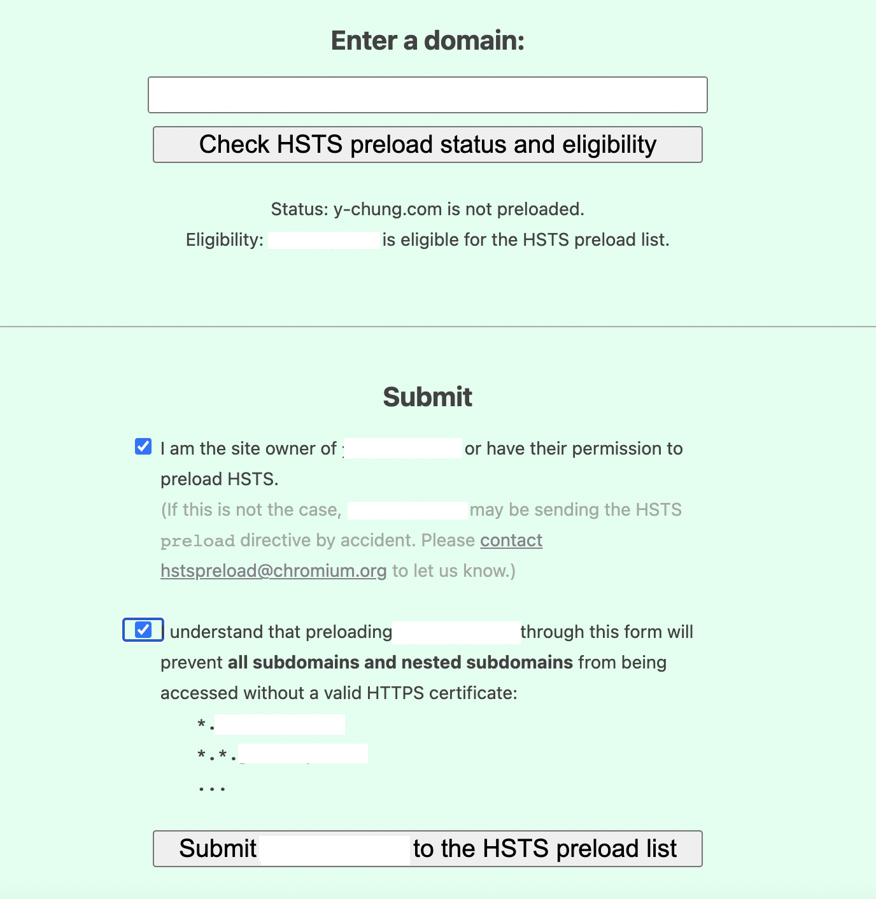

# 프론트 앤드 개발자가 알아야할 웹 보안은 무엇이 있을까?

## 읽기 전에 알려드립니다.

1. [Front-End-Checklist : thedaviddias, 깃헙](https://github.com/thedaviddias/Front-End-Checklist)에서 제공하는 보안 항목을 기준으로 공부했다.
2. [Front-End-Checklist : thedaviddias, 깃헙](https://github.com/thedaviddias/Front-End-Checklist)에서 제공한 [Security Headers](https://securityheaders.com/)와 [Observatory by Mozilla](https://observatory.mozilla.org/analyze/y-chung.com)에서 나의 웹 어플리케이션의 도메인을 입력하면 그 어플리케이션의 보안 수준을 알 수 있다. 두 웹 사이트가 부여하는 등급의 수준이 다를 수 있다.
3. 백앤드 개발 환경은 NodeJS다.
4. helmetjs와 같은 expressjs 환경에서 보안을 공부하면서 쓴 글이기 때문에 다른 환경의 개발자들에게 도움이 되지 않을 수 있다.
5. 공부를 하면서 찾은 것들을 집약해서 정리하느라 많이 길다. 그래서 필요한 부분만 읽을 수 있다. 맥락으로 이어지도록 썼지만 개별적이다.
6. HTTPS와 HSTS, XSS, CSP, CSRF, CORS에 대해서 다루고 있다.(이걸 다루다 보면 고구마 줄기처럼 서브 개념들이 마구 딸려온다. HTTPS만 해도 HTTP를 알고 있어야하고 TCP/IP 개념도 알아야한다. 하지만 서브 개념들은 여기서 다루지 않는다. 말이 서브지 중요한 개념이다보니 가볍게 익힐수도 없고 시간을 들여서 공부해야한다.)
7. 참고로 난 취준생이기 때문에 최대한 개념과 실재 적용 방법을 사례로 찾아 정리했다. 불안하면 참고하지 않아도 된다.

## HTTPS - Hyper Text Transfer Secure

HTTPS는 웹 보안의 아주 기본 사항이라고 한다. 구글, 네이버를 포함해서 대부분의 사이트가 HTTPS를 적용하고 있다. 그래서 도메인을 구매할 때, SSL인증 키를 함께 사서 내가 개발한 웹 페이지에 HTTPS를 적용시켰다. 하지만 어렴풋이 알고 있는 개념이 오히려 나에게 독이 될 것 같았다.

### 대칭키와 비대칭키

HTTP는 사람이 읽을 수 있는 언어로 되어있기 때문에 클라이언트와 서버간의 요청과 응답을 주고 받을 때, 누군가가 중간에서 가로챌수 있다. HTTPS는 그 정보를 누구나 다 볼 수 없도록 가려주는 역할을 한다.

HTTPS는 HTTP 메시지를 가려주는 방법으로 비대칭키(공개키)를 사용한다. 공개키는 서비스를 제공하는 쪽(서버)에서 사용자에게 배포하는 키다. 비공개키(개인키)는 서버에서만 가지고 있는다. 같은 공개키로 암호문을 풀 수 없고 오직 비공개키로만 풀 수 있다. 반대로 공개키로 풀 수 있는 건 한 쌍이되는 개인키로 암호화된 정보만 가능하다.

HTTPS를 적용하면 모든 내용을 암호화하는 것은 아니다. 내용은 공개키로 암호화를 하고 이 공개키를 비대칭키로 암호화를 한다.

### HTTPS가 신뢰할 수 있는지 것인지 어떻게 알 수 있을까?

HTTPS는 CA 인증을 받은 회사에서 SSL 인증을 발급해준다. 브라우저 내부에는 CA 인증을 받은 회사 목록이 저장되어있다. 그래서 서버에서 클라이언트로 실어보낸 인증서는 클라이언트는 브라우저에 저장된 CA의 공개키로 복호화를 할 수 있다. 그래서 공인 인증 목록에 없는 인증서를 보내는 웹 페이지를 거를 수 있게 된다.

개인정보에 민감한 곳일 수록 SSL 인증은 아주 기본적인 사항이면서 필수 사항이라고 볼 수 있다.

SSL 인증은 도메인 주소를 판매하는 곳에서 함께 구매할 수 있으며 그외에 SSL 인증을 해주는 CA에서 구매하여 나의 도메인에 적용할 수 있다.

> 참고한 글
> [네트워크 - HTTP/HTTPS 차이점, HTTPS란? : 코딩스타트](https://coding-start.tistory.com/208)  
> [How is HTTPS different from HTTP? : SSL.com](https://www.ssl.com/faqs/what-is-https/)  
> [HTTPS란? (동작방식, 장단점) : EunJeong Kwak](https://rachel-kwak.github.io/2021/03/08/HTTPS.html)  
> [HTTPS가 뭐고 왜 쓰나요? (Feat. 대칭키 vs. 비대칭키) : 얄팍한 코딩사전](https://youtu.be/H6lpFRpyl14)

### HTTPS로 강제 접속하게 하기

처음에 HTTPS를 구매해서 인증서를 적용하면 사용자가 도메인을 입력 했을 때, 자동으로 HTTPS로 접속하는 줄 알았다. 그런데 그렇게 되지 않았다. 찾아보니까 사용자가 HTTPS를 통해 도메인으로 접근 할 수 있도록 설정을 해주어야한다. 나는 heroku를 이용 중이고 expressjs를 사용하고 있다.

> 참고
> [Can Heroku force an application to use SSL/TLS?](https://help.heroku.com/J2R1S4T8/can-heroku-force-an-application-to-use-ssl-tls)  
> [nodejs -- http -> https 변환 ( redirect ) :취미로 하는 프로그래밍 !!!](https://freeprog.tistory.com/457)

히로쿠를 통해 배포 중이라면 이 코드는 사용하지 않아야한다.

```javascript
// 이 예제는 히로쿠에서 리다이렉션 무한 루프를 돌게된다.
app.use((req, res, next) => {
  if (process.env.NODE_ENV === "production" && !req.secure) {
    res.redirect(`https:${req.headers.host}${req.url}`);
  } else {
    next();
  }
});

// 이 예제는 hsts 설정이 무의미하다고 경고 메시지가 뜨게 된다.
app.use((req, res, next) => {
  if (process.env.NODE_ENV === "production") {
    return req.headers["X-Forwarded-Proto"] === "http"
      ? res.redirect(`https://${req.headers.host}${req.url}`)
      : next();
  } else {
    next();
  }
});
```

위의 코드를 사용하면 히로쿠에서는 무한 루푸로 리다이렉션을 요청하다가 서버에서 에러를 뱉어내는데 이유는 아래와 같다.

> Heroku, nodejitsu and other hosters often use reverse proxies which offer SSL endpoints but then forward unencrypted HTTP traffic to the website. This makes it difficult to detect if the original request was indeed via HTTPS.
> [출처 : express-sslify](https://www.npmjs.com/package/express-sslify)

그래서 반드시 headers에 'X-Forwarded-Proto'설정이 http인지 아닌지를 통해서 리다렉션을 진행해주어야한다. 아래 코드를 사용하면 리다이렉션에 성공할 수 있다.

```javascript
app.use((req, res, next) => {
  if (req.get("X-Forwarded-Proto") == "https" || req.hostname == "localhost") {
    //Serve Angular App by passing control to the next middleware
    next();
  } else if (
    req.get("X-Forwarded-Proto") != "https" &&
    req.get("X-Forwarded-Port") != "443"
  ) {
    //Redirect if not HTTP with original request URL
    res.redirect(`https://${req.hostname}${req.url}`);
  }
});

// 코드 출처 스택 오버플로우
// https://stackoverflow.com/questions/40876599/express-js-force-https-ssl-redirect-error-too-many-redirects
```

### hsts

마지막 단계가 남았다. [helmet](https://www.npmjs.com/package/helmet)을 사용하고 있다면 helmet.hsts()를 설정을 해주어야한다. helmet을 사용하지 않아도 hsts를 설정할 수 있다. hsts는 옵션이기 때문에 설정하지 않아도 되지만 설정하게 되면 다음과 같은 효과를 누릴수 있다.

> The HTTP Strict-Transport-Security response header (often abbreviated as HSTS) lets a web site tell browsers that it should only be accessed using HTTPS, instead of using HTTP.
> [Strict-Transport-Security - MDN](https://developer.mozilla.org/en-US/docs/Web/HTTP/Headers/Strict-Transport-Security#preloading_strict_transport_security)

hsts가 설정되면 브라우저는 반드시 HTTPS로 접속해야한다고 알려주게 된다. 그래서 redirect로 https로 접속하도록 하면 사용자가 사용하는 컴퓨터에서 http를 사용해 웹 페이지에 접근하더라도 브라우저는 https만 사용한다. [hstspreload.org](https://hstspreload.org/)에서 hsts가 올바르게 적용되었는지 확인할 수 있다.



성공하면 기분 좋은 녹색을 볼 수 있다.

## XSS - Cross-Site Scripting

XSS 취약점은 게시판을 구현하면서 알게 되었다. 처음에는 MDN에서 게시판을 커스텀하려고 시도했는데, XSS를 걸러내는 게시판을 구현하기 어렵다는 생각이 들었다. 그래서 XSS 취약점을 최소한으로 방어하고 있는 패키지를 찾아 사용하는 쪽으로 방향을 전환하게 되었다. XSS 공격에 대비하지 않았을 경우 사용자에게 끼칠 수 있는 악영향이 매우 크다.

> [웹 해킹 강좌 ⑦ - XSS(Cross Site Scripting) 공격의 개요와 실습 (Web Hacking Tutorial #07) : 동빈나](https://youtu.be/DoN7bkdQBXU)

해커가 스크립트를 저장하거나 반사해서 웹 페이지의 개인정보를 탈취하 등의 일을 할 수 있기 때문에 시연 영상을 보면서 아찔했다. XSS를 시도하는 공격은 보안 전문가가 방어를 잘 했다고 판단해도 해커가 가능한 모든 경우의 수를 찾아내려고 노력하기 때문에 미처 생각치 못한 부분에서 공격이 이루어질 수 있다. 따라서 어떤 라이브러리를 썼다고 해도 XSS 취약점은 매번 관심을 가지고 최소한의 기준을 높여 대비해야한다.

한국 인터넷 진흥원에 올라온 논문을 읽으면 그 종류와 일어날 수 있는 피해 사례에 대해서 소개하고 있다. 대응 방법에 대해서는 XSS 공격을 막을 수 있는 라이브러리 사용을 추천하고 있다.

> [크로스 사이트 스크립팅(XSS) 공격 종류 및 대응 방법 : 성윤기, www.kisa.or.kr, pdf](https://www.kisa.or.kr/public/library/IS_View.jsp?mode=view&p_No=158&b_No=158&d_No=105)

Dompurify와 같은 XSS 취약점을 방어하기 위해 만든 패키지를 폼 태그에 사용하게 되면 사용자가 게시글을 작성 할 때, <, >, javascript:, sciprt, input 등의 태그를 걸러서 애초에 쓰기 단계에서부터 사용하지 못하도록 거르는게 가능하다. HTML에서 인라인 자바스크립트 코드를 지양해야한다.

### helmet.xssFilter() - 조금 다른 이야기

조금 다른 이야기지만 helmet.xssFilter() 설정에 대한 이야기를 잠깐 해볼까 한다.

ExpressJS에서 [프러덕션 우수사례:보안](https://expressjs.com/ko/advanced/best-practice-security.html#use-helmet)에서 helmet을 사용할 것을 권장하고 있다. helmet이 만능은 아니지만 최소한의 조치라고 생각된다.

> helmet에 관련된 아티클
> [What is Helmet.js & Why it is a Security Best Practice For Express.js](https://www.securecoding.com/blog/using-helmetjs/#X-XSS-Protection)

```javascript
// default X-XSS-Protection : 0
app.use(helmet.xssFilter());
```

[helmetjs/helmet](https://github.com/helmetjs/helmet) helmetjs 깃헙 사이트에서 xssFilter 옵션 사용 방법을 알 수 있다. helmet 이슈 #230에서 X-XSS-Protection 헤더를 기본적으로 비활성화 해야한다고 한다. [X-XSS-Protection: header should be disabled by default #230](https://github.com/helmetjs/helmet/issues/230) 비활성화를 하라고 권장하는 이유는 [X-XSS-Protection block 설정하는 것이 효과 없음이 발견됐기](https://github.com/helmetjs/helmet/issues/230#issuecomment-611904252) 때문인 것 같다. 크롬은 XSS Auditor를 삭제했고, 다른 많은 브라우저도 지원하지 않는다. [Update: Cross_Site_Scripting_Prevention_Cheat_Sheet #376](https://github.com/OWASP/CheatSheetSeries/issues/376)

> X-XSS-Protection : MDN
> [X-XSS-Protection : MDN](https://developer.mozilla.org/en-US/docs/Web/HTTP/Headers/X-XSS-Protection)

'아니 그럼 도데체 어떻게 막으라고?'라는 생각을 하다가 위에 이슈에서 공유해준 아티클을 읽으면서 그 궁금증을 해소할 수 있었다. 아래는 아티클의 원문을 그대로 인용했다.

> Microsoft confirmed it is removing XSS Filter in Edge. “We are retiring the XSS Filter in Microsoft Edge beginning in today’s [Windows 10 Insider Preview] build,” the company said. **“Our customers remain protected thanks to modern standards like Content Security Policy, which provide more powerful, performant, and secure mechanisms to protect against content injection attacks, with high compatibility across modern browsers.”**
> 출처 : [XSS protection disappears from Microsoft Edge : James Walker, the daily-swig ](https://portswigger.net/daily-swig/xss-protection-disappears-from-microsoft-edge)

## CSP - Content Security Policy

> 이 개요는 최신 브라우저에서 XSS 공격의 위험과 영향을 현저히 줄일 수 있는 방어책인 콘텐츠 보안 정책(CSP)에 중점을 두고 있습니다.
> [콘텐츠 보안 정책 : 구글](https://developers.google.com/web/fundamentals/security/csp?hl=ko)

SOP는 www.example.com에서는 www.example.com의 소스만 읽을 수 있고 www.attack.com의 소스를 사용할 수 없도록 한다. 동일 출처 정책을 하는 이유는 외부의 신뢰성이 불분명한 소스를 사용하지 않도록 하고 외부 공격을 막기 위해서다. 하지만 XSS 공격으로 실재로 SOP가 제대로 작동하지 않을 수 있다.

> 참고
> [SOP, CORS, CSP 개념과 우회방법(Concept & Bypass) : Dyrandy](https://w01fgang.tistory.com/147#recentComments)

웹 보안은 모델은 동일 출처 정책에 근간을 두고 있다. SOP(동일 출처 정책)는 이론적으로 완벽했으나 XSS 공격으로 시스템이 파괴되었다고 한다. 그래서 CSP를 통해 XSS 공격을 최소화 할 수 있다고 소개한다. CSP는 서버가 클라이언트에게 허용되는 소스 목록을 제공하게 한다. CSP에서 설정되지 않은 소스는 바로 오류를 발생시키고 사용할 수 없게 막는다.

[CSP 옵션](https://content-security-policy.com/) 다양하다. helmetJS에서 기본값으로 설정해서 사용할 수 있지만 웬만하면 어떤 리소스를 허용할 것인지 옵션값을 넣는 것이 좋다. 내가 생각했을 때, CSP 옵션 설정은 사전 설계를 어느정도까지 치밀하게 했느냐에 따라서 여러 옵션을 다양하게 설정할 수 있는 것 같다. 이것도 내가 개발하는 어플리케이션의 규모에 따라서 달라질 수 있다

참고로 helmet CSP를 기본값으로 설정하면 Webpack develop mode로 build한 스크립트가 eval 함수 때문에 막히게 된다. 그래서 개발하는 중에는 'unsafe-eval'을 허용해서 스크립트가 막힘이 없게 하고 production 레벨에서 'self'로 바꿀 수 있다.

CSP 평가는 [CSP EVALUATION](https://csp-evaluator.withgoogle.com/)에서 할 수 있다.

## CSRF - Cross Site Request Forgery

교차 사이트 요청 위조에 대한 자료를 읽어보면 무섭다. 인증된 나의 권한으로 공격자가 의도한 기능을 실행시켜 웹 어플리케이션의 개인 정보를 유출하는 등의 일을 할 수 있기 때문이다. 직접 권한을 가져오는 것은 불가능하지만 스크립트 공격이 가능하면 사용자에게 특정 행동을 유도해서 스크립트 문을 실행시킬 수 있다.

expressjs에서 csurf란 패키지를 설치한다. 예제에 나와있는데로 csrf를 설정해서 form에 token을 불러와 인증하도록 하게 한다. 미들웨어에서 csurf token을 확인하고 token 값이 있으면 게시물을 등록하게 한다. 만약 token값이 일치하지 않으면 게시물을 작성하지 못한다

> 참고  
> [CSRF란?](https://brownbears.tistory.com/251)  
> [웹 해킹 강좌 ⑩ - CSRF(Cross Site Request Forgery) 공격 기법 (Web Hacking Tutorial #10)](https://www.youtube.com/watch?v=nzoUgKPwn_A)  
> [csurf](https://www.npmjs.com/package/csurf)  
> [CSRF protection in ExpressJS](https://gabrieleromanato.name/csrf-protection-in-expressjs)

## CORS - Cross-Origin Resource Sharing

교차 출처 리소스 공유는 도메인 A에서 도메인 B에게 XMLHttpRequest를 사용하여 리소스를 요청하는 경우에 해당한다. CORS는 CSP와 비슷해보였다. CORS는 지도 API 등을 HTTP 요청을 할때 내가 요청하는 HTTP가 안전한 출처라고 서버에 미리 알려주는 것이다. 보통 자바스크립트에서 fetch를 통해 외부 리소스를 요청할 때, 오류가 발생할 수 있는데 [SOP(Same Origin Policy)](https://dongwooklee96.github.io/post/2021/03/23/sopsame-origin-policy-%EB%9E%80-%EB%AC%B4%EC%97%87%EC%9D%BC%EA%B9%8C/)때문에 막힐 수 있다.

SOP의 존재는 나를 매우 불편하게 만든다. 하지만 SOP가 존재하는 이유는 인터넷 상에 존재하는 모든 소스를 신뢰할 수 없기 때문이다. 그 소스가 해커에 의해서 만들어진 소스일 수도 있다. XSS나 CSRF 공격을 막기 위한 조치이기도 하다. expressjs 환경에서는 [cors 패키지](https://expressjs.com/en/resources/middleware/cors.html)를 사용하여 CORS 환경을 세팅하게 한다.

나는 font-face 때문에 cors를 설정했을 때 에러를 만났는데, [리스폰스 헤더 값을 와일드 카드로 설정하도록 권장하고 있었다.](https://www.w3.org/TR/css-fonts-3/#font-fetching-requirements) 하지만 이렇게 설정하게 되면 **CORS가 무슨 소용이지** 싶다. 아직 해결하지 못한 과제로 남겨놔야할 것 같다.

> 참고
> [SOP(Same Origin Policy)](https://dongwooklee96.github.io/post/2021/03/23/sopsame-origin-policy-%EB%9E%80-%EB%AC%B4%EC%97%87%EC%9D%BC%EA%B9%8C/)  
> [@font-face속성에서 url()로 폰트 리소스 호출 시 만난 CORS에러](https://sustainable-dev.tistory.com/166)  
> [CORS는 왜 이렇게 우리를 힘들게 하는걸까? : Evans Libary](https://evan-moon.github.io/2020/05/21/about-cors/#cors%EC%97%90-%EB%8C%80%ED%95%9C-%EA%B8%B0%EB%B3%B8%EC%A0%81%EC%9D%B8-%EB%82%B4%EC%9A%A9)  
> [교차 출처 리소스 공유 (CORS)](https://developer.mozilla.org/ko/docs/Web/HTTP/CORS)  
> [cors : npm](https://www.npmjs.com/package/cors#simple-usage-enable-all-cors-requests)

## Permissions Policy

마지막으로 Permission Policy는 해당 웹 어플리케이션이 카메라, 마이크, 위치, 결재 등의 기능에 접근 하게 할 것인지를 허용 여부를 묻는 정책이다. Permission Policy를 헤더에 설정함으로 써, 누군가가 외부에서 강제로 사용자의 카메라 등에 접근해서 강제로 사용하게 끔 하는 것을 미리 방지 할 수 있다. npm 패키지로 [permissions-policy](https://www.npmjs.com/package/permissions-policy)가 있다.

[Permissions Policy Explainer](https://github.com/w3c/webappsec-permissions-policy/blob/main/permissions-policy-explainer.md)
